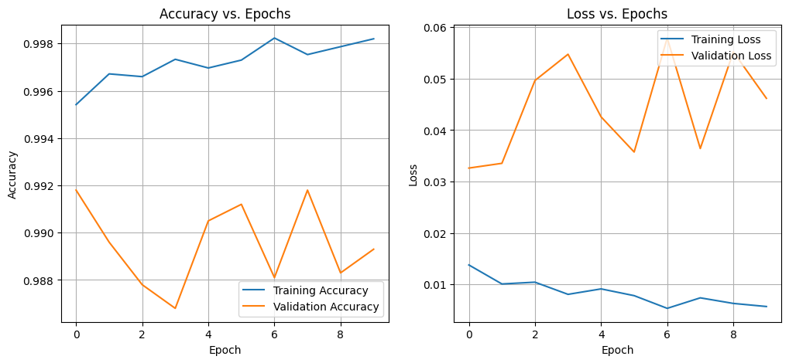

# LeNet-5 Implementation on MNIST

This project is my implementation of the classic LeNet-5 Convolutional Neural Network architecture using TensorFlow and Keras. I built this model to demonstrate the end-to-end pipeline of training a Deep Learning model, from data preprocessing to evaluating performance on the MNIST dataset.

## Project Overview

I engineered this project to reconstruct Yann LeCun's pioneering CNN architecture, adapting it with modern techniques (such as Max Pooling and ReLU activations) to maximize performance.

**My Key Contributions:**
* **Model Design**: I constructed the LeNet-5 architecture from scratch using the TensorFlow Keras Sequential API.
* **Architecture Adaptation**: I replaced the traditional Average Pooling with Max Pooling layers to improve feature extraction capabilities.
* **Training Pipeline**: I implemented a robust training loop using the Adam optimizer and Sparse Categorical Crossentropy loss.
* **Visualization**: I wrote scripts to visualize training metrics, allowing me to analyze the model's convergence over time.

## Model Architecture

I defined the model architecture with the following layer progression, designed to accept $(28, 28, 1)$ input images:

1.  **Convolution (C1)**: 6 filters, $5 \times 5$ kernel, ReLU activation (Padding: Same).
2.  **Max Pooling (S2)**: $2 \times 2$ pool size, stride 2.
3.  **Convolution (C3)**: 16 filters, $5 \times 5$ kernel, ReLU activation (Padding: Valid).
4.  **Max Pooling (S4)**: $2 \times 2$ pool size, stride 2.
5.  **Convolution (C5)**: 120 filters, $5 \times 5$ kernel, ReLU activation.
6.  **Flatten**: Reshapes the 3D feature maps into a 1D vector.
7.  **Fully Connected (F6)**: 84 units, ReLU activation.
8.  **Output Layer**: 10 units (Logits) representing the digit classes.

## Tech Stack

* **Language**: Python
* **Framework**: TensorFlow / Keras
* **Libraries**: NumPy (Data manipulation), Matplotlib (Visualization)

## How to Run My Code

You can run the full training pipeline and see the results directly in Google Colab:

## Results

I trained the model for 10 epochs and achieved the following performance metrics:

* **Training Accuracy**: >99%
* **Test Accuracy**: 98%

Below are the performance graphs generated during training, showing the accuracy and loss curves for both the training and validation sets:

## References

* Y. LeCun, L. Bottou, Y. Bengio, and P. Haffner. "Gradient-based learning applied to document recognition." Proceedings of the IEEE, 86(11):2278-2324, November 1998.
